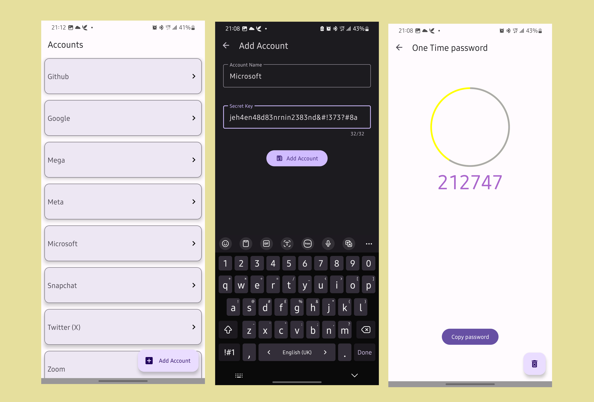

<a href="https://appetize.io/app/kb3hfjs3s5g5nrehn4wwx5vlz4?device=pixel7&osVersion=13.0&scale=75" target="_blank" rel="nofollow noopener noreferrer" 
  aria-label="Live Demo"> <u>Live Demo 🚀</u> </a>

# 2FA

An authentication android app that generates Time-Based One-Time-Passwords for online authentication. It was developed using Kotlin, Room database, Jetpack Datastore, and Base32 for encoding and decoding. It leverages github actions for CI/CD and generate an apk artifacts on push.

---

## License

[Apache License](LICENSE)
